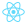
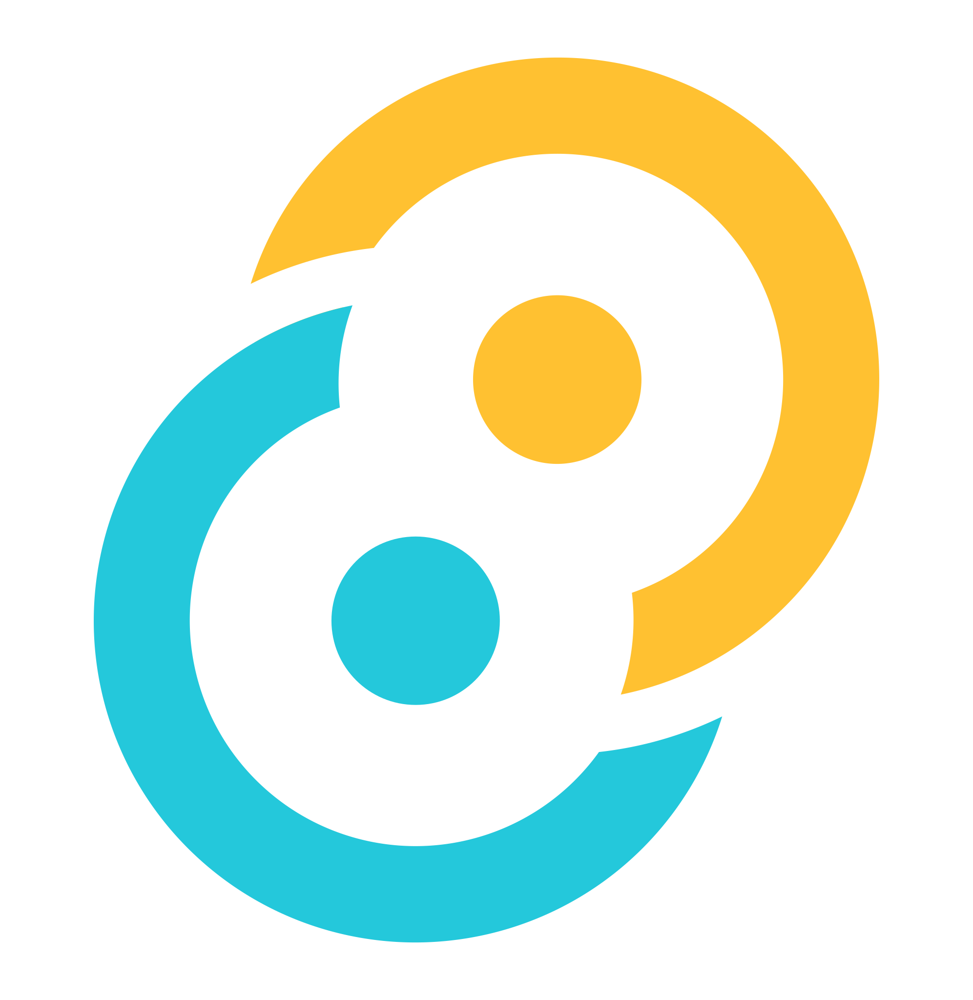
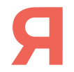
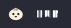
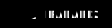

<a href="mailto:contact@thomascauquil.fr">
	

		   
    	<picture>
    		<source media="(prefers-color-scheme: dark)" srcset="assets/header_dark.svg">
    		<source media="(prefers-color-scheme: light)" srcset="assets/header_light.svg">
    		
    	</picture>
    

</a>

# 
Full Stack Developer and Reverse Engineering Enthusiast

 

  

 

<table align="center">
<tr>
<td align="center" valign="top" width="140px">

### Frontend

<picture>
	
</picture>
<picture>
	
</picture>
<picture>
	
</picture>
<picture>
	
</picture>
</td>

<td align="center" valign="top" width="140px">

### Backend

<picture>
	
</picture>
<picture>
	
</picture>
<picture>
	
</picture>
<picture>
	
</picture>
</td>

<td align="center" valign="top" width="140px">

### Apps

<picture>
	
</picture>
<picture>
	
</picture>
<picture>
	
</picture>
<picture>
	
</picture>
</td>

<td align="center" valign="top" width="140px">

### DevOps

<picture>
	
</picture>
<picture>
	
</picture>
<picture>
	
</picture>
<picture>
	
</picture>
</td>

<td align="center" valign="top" width="140px">

### Work

<picture>
	
</picture>
<picture>
	
</picture>
<picture>
	
</picture>
<picture>
	
</picture>
</td>

</tr>
</table>

 

 

### My Top Apps

<table width="100%">
<tr>
	<td>
		<a href="https://arc.net/">
			<picture>
				
			</picture>
		</a>
	</td>
	<td><b>Arc Browser</b> <i>Free</i></td>
	<td>The best browser I ever used, but it's not open source</td>
</tr>
<tr>
	<td>
		<a href="https://github.com/gnachman/iTerm2">
			<picture>
				
			</picture>
		</a>
	</td>
	<td><b>iTerm2</b> <i>Open Source</i></td>
	<td width="630px"></td>
</tr>
</tr>
<tr>
	<td>
		<a href="https://www.raycast.com/">
			<picture>
				
			</picture>
		</a>
	</td>
	<td><b>Raycast</b> <i>Free</i></td>
	<td>What Spotlight should have been </td>
</tr>
<tr>
	<td>
		<a href="https://rectangleapp.com/pro">
			<picture>
				
			</picture>
		</a>
	</td>
	<td><b>Rectangle</b> <i>9,99 €</i></td>
	<td>Apple must have this built-in by default</td>
</tr>
<tr>
	<td>
		<a href="https://github.com/lwouis/alt-tab-macos">
			<picture>
				
			</picture>
		</a>
	</td>
	<td><b>AltTab</b> <i>Free</i></td>
	<td><3</td>
</tr>
<tr>
	<td>
		<a href="https://orbstack.dev/">
			<picture>
				
			</picture>
		</a>
	</td>
	<td><b>OrbStack</b> <i>Free Beta</i></td>
	<td>Powerful and lightweight, compared to Docker Desktop</td>
</tr>
<tr>
	<td>
		<a href="https://github.com/obsidianmd/obsidian-releases">
			<picture>
				
			</picture>
		</a>
	</td>
	<td><b>Obsidian</b> <i>Free</i></td>
	<td>Not the best, but I don't like Notion (not open source)</td>
</tr>
<tr>
	<td>
		<a href="https://lmstudio.ai/">
			<picture>
				
			</picture>
		</a>
	</td>
	<td><b>LM Studio</b> <i>Free</i></td>
	<td>My ChatGPT local (llama2)</td>
</tr>
<tr>
	<td>
		<a href="https://github.com/PlayCover/PlayCover">
			<picture>
				
			</picture>
		</a>
	</td>
	<td><b>PlayCover</b> <i>Open Source</i></td>
	<td>Useful for launching unsigned IOS apps</td>
</tr>
<tr>
	<td>
		<a href="https://proxyman.io/">
			<picture>
				
			</picture>
		</a>
	</td>
	<td><b>Proxyman</b> <i>92,00 €</i></td>
	<td>Better interface and ease of use than Charles</td>
</tr>
<tr>
	<td>
		<a href="https://github.com/rustdesk/rustdesk">
			<picture>
				
			</picture>
		</a>
	</td>
	<td><b>RustDesk</b> <i>Open Source</i></td>
	<td>Alternative to TeamViewer, in Rust and Open Source</td>
</tr>
</table>

 

	 

